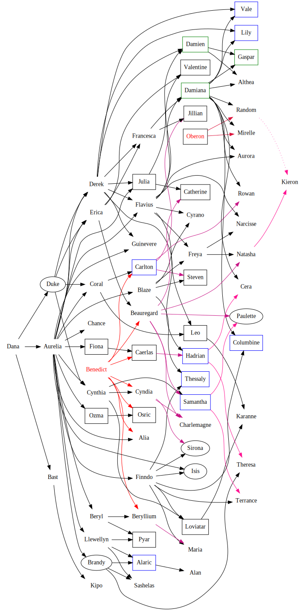

## Cobaltean Royal Family

### Notes:

1. Ages are as of the introduction of [Cobalt](CobaltPromontory), two time jumps and one Spiral boom ago, needs much updating.
1. Many Cobalteans have the same name as other Real people, but the [Benedict](BenedictOfOberon) ''is'' Benedict of [Amber](KolvirPromontory#shadowkolvir).
1. There are new Cobalteans, and some of the people on this list are dead or missing.
1. Missing and dead Cobalteans are in italics; those of the Blood of Amber are in color.

The [Cobalt Family Bush](http://www2.primushost.com/~dskern/www/amber/CobaltXtreeXcolor.GIF) is more graphic, but outdated:

This is a newer dot-generated picture (dot -Tsvg CobalteanRoyalFamily.gv -o CobalteanRoyalFamily.svg) from the [Cobalt Royal Family Bush GV file](CobalteanRoyalFamily.gv), but still needs updating with the information in the picture above:

  

### Key:
 + **Alive**
 + *Missing* - in the image is circled
 + *Dead* - in the image a box is dead, blue is dead in the [Spiral Explosion](SpiralExplosion), green is a ghost
 + Great-Grandchild of Dworkin/Grandchild of Oberon
 + Great-Great-Grandchild of Dworkin/Great-Grandchild of Oberon
 + Great-Great-Grandchild of Dworkin Twice Over/Great-Grandchild of Oberon Twice Over
 + Great-Great-Great-Grandchild of Dworkin/Great-Great-Grandchild of Oberon
 + Great-Great-Grandchild and Great-Great-Great-Grandchild of Dworkin/Great-Grandchild and Great-Great-Grandchild of Oberon
 + Great-Great-Great-Grandchild of Dworkin Twice Over/Great-Great-Grandchild of Oberon Twice Over

### People:

 + **<a name="dana">Dana</a>** -- ???? Ancient, abdicated Queen of [Cobalt](CobaltPromontory). Designer of the Spiral. A charming old lady, she is an old grandmotherly type. She doesn't get out much anymore, and leaves the governance of [Cobalt](CobaltPromontory) to her daughter. Mother of [Aurelia](#aurelia), [Duke](#duke), and [Bast](#bast).
 + **<a name="aurelia">Aurelia</a>** -- ???, Daughter of [Dana](#dana) and an unknown elder god. Aura to her friends, she rules [Cobalt](CobaltPromontory). She's an amazing one for taking care of problems once they happen, but she tends not to foresee them. Powerful as all get out. Current wielder of the Gem of Fate. Mother of [Beryl](#beryl), [Ozma](#ozma), [Fiona](#fiona), [Erica](#erica), [Coral](#coral), [Cynthia](#cynthia), [Derek](#derek), [Alia](#alia), [Finndo](#finndo), [Blaze](#blaze), [Llewellyn](#llewellyn), [Brandy](#brandy), [Flavius](#flavius), [Julia](#julia), [Isis](#isis), [Guinevere](#guinevere), and [Chance](#chance).
 + *<a name="duke">Duke</a>* -- (???), Son of [Dana](#dana) and an Elder God. Weirdo. Vanished into the [Fractal Realm](CobaltPromontory) a long time ago. Father of [Erica](#erica), [Coral](#coral), [Cynthia](#cynthia), and [Derek](#derek).
 + **<a name="beryl">Beryl</a>** -- 737, Daughter of [Aurelia](#aurelia) and Mortalius, the Warlord of the [Fractal Realm](CobaltPromontory). Ancient Warrior. She is Master of Arms for [Cobalt](CobaltPromontory), and is the coordinator for the defenses of that place with [Cynthia](#cynthia), [Finndo](#finndo), and [Julia](#julia), also working closely with Ylwin (Marshal of Sapphire) and [Lapis Lazuli's](CobaltPromontory) force  ommanders. Mother of [Beryllium](#beryllium) and [Pyar](#pyar).
 + *<a name="ozma">Ozma</a>* -- (714) Daughter of [Aurelia](#aurelia) and Mortalius. Dead. Mother of [Osric](#osric).
 + *<a name="fiona">Fiona</a>* -- (712) Daughter of [Aurelia](#aurelia) and Mortalius. Dead. Mother of [Caerlas](#caerlas).
 + **<a name="erica">Erica</a>** -- 603, Daughter of [Aurelia](#aurelia) and Indra, a god of storms and rulership. Diplomat par excellance. Her agents are were-black panthers. She was also Heir Apparent before her recent incapacity, as [Beryl](#beryl) removed herself from consideration following the deaths of her sisters. A frequent Regent. She was mortally injured during an expedition to find [Chance](#chance), although she recovered against expectations).  The Warlord of [Cobalt](CobaltPromontory) for a while, but was possessed by [Toram](ToramOfMages).  The possession has been cleared out, although all of the Amberites mustered to defeat her (they were bored). Mother of [Beauregard](#beauregard), [Francesca](#francesca), and [Valentine](#valentine).
 + **<a name="coral">Coral</a>** -- 571, Daughter of [Aurelia](#aurelia) and Indra. [Melkizedik](TimeLordMelkizedik)'s Apprentice. She could have been a warrior to rival [Erica](#erica) or [Blaze](#blaze), but instead focused her attentions and energy on [Cerulean](CobaltPromontory) until it cracked. Wearer of the Cerulean Crown. She is an accomplished shapeshifter, poet, architect, musician, and the best fortune-teller of the family. She's not a bad warrior, just nowhere near as good as she could be if she put her mind to it. Mother of [Carlton](#carlton) and [Leo](#leo).
 + **<a name="cynthia">Cynthia</a>** -- 526, Daughter of [Aurelia](#aurelia) and Indra. A fascinating woman, she has often been compared to a beautiful snake. She is usually encased in black leather that would impress a cenobite. Admiral of the Northern Fleet. Mother of [Cyndia](#cyndia), [Samantha](#samantha), and [Loviatar](#loviatar).
 + **<a name="derek">Derek</a>** -- 485, Son of [Aurelia](#aurelia) and Indra. Captain of the Palace Guard. Has a thing for [Coral](#coral), but she's oblivious. Wields an immense magical axe named Syrbal, which can split mountains and cut canyons in flat land. He is known for tremendous feats of Endurance. Father of [Francesca](#francesca), [Hadrian](#hadrian), [Flavius](#flavius), [Julia](#julia), [Guinevere](#guinevere), [Lily](#lily), [Vale](#vale), and [Damien](#damien).
 + **<a name="beauregard">Beauregard</a>** -- (399), [Erica](#erica) and [Benedict's](BenedictOfOberon) son. Dead; died of treachery trying to negotiate a treaty with the [Fractal Realm](CobaltPromontory).  Avenged by [Cynthia](#cynthia). A PC. Father of [Charlemagne](#charlemagne), [Samantha](#samantha), [Catherine](#catherine), [Paulette](#paulette), and [Natasha](#natasha).
 + *<a name="caerlas">Caerlas")</a>* -- (399) [Fiona](#fiona) and [Benedict's](BenedictOfOberon) daughter. Dead. Mother of [Hadrian](#hadrian).
 + **<a name="cyndia">[Cyndia](CyndiaOfBenedict)</a>** -- 399, [Cynthia](#cynthia) and [Benedict's](BenedictOfOberon) daughter. Also called Cindy. Guildmistress of the [Chaosian](CourtsOfChaos) [Warrior's](WarriorsGuild) [Guild](ChaosGuilds), fighting her way up to the top to earn the respect of the guild. She has inherited her mother's deviousness, but tends more to practical jokes than torture. Not that her mother would torture anyone, mind you... Mother of [Charlemagne](#charlemagne) and [Sirona](#sirona). [See also](CyndiaOfBenedict).
 + *<a name="carlton">Carlton</a>* -- (399), [Coral](#coral) and [Benedict's](BenedictOfOberon) son. Died in the [Spiral Explosion](SpiralExplosion). A shapeshifter as well, but far more pragmatic than his mother. Has little interest in [Cerulean](CobaltPromontory).  Known for his good taste in clothing, and his engineering skills. Father of [Jillian](#jillian), [Steven](#steven), and [Rowan](#rowan).
 + *<a name="osric">Osric</a>* -- (399) Son of [Ozma](#ozma) and [Benedict](BenedictOfOberon). Dead.
 + **<a name="beryllium">Beryllium</a>** -- 399, [Beryl](#beryl) and [Benedict's](BenedictOfOberon) daughter. Saddled with the unfortunate nickname of "Berry", she's quite a level-headed warrior. She bears a shape-shifting weapon (named Selar), which will become anything she wishes it to as long as it fits the paradigms of whatever [Shadow](ShadowPlaces) she is in. Mother of [Maria](#maria) and a stillborn child, after which she stopped having children.
 + **<a name="alia">Alia</a>** (Ah'-lee-uh) -- 399, Daughter of [Aurelia](#aurelia) and [Benedict](BenedictOfOberon). Head of the secret police in [Cobalt](CobaltPromontory), running a Shadow of [Florimel's](FlorimelOfOberon) organization. She is the assassin who knows _every_thing. Rumored to be a full Shapeshifter. She is frighteningly unemotional, and wholly uninterested in having children, who might be used as a lever against her. Presumed to still be alive, but has not been seen since the [Loviatar](#loviatar) affair.
 + **<a name="finndo">Finndo</a>** -- 388, Son of [Aurelia](#aurelia) and Ptah, a Lord of Creation. Physical and psychic powerhouse. The Wizard-Admiral of the Southern Fleet. Canny, quick-witted, and beloved by the sailors under him, Finndo is happiest at sea. He racks spells capable of recreating the ships in his fleet when necessary. Father of [Maria](#maria), [Sirona](#sirona), [Isis](#isis), [Thessaly](#thessaly), [Columbine](#columbine), [Terrance](#terrance), and [Loviatar](#loviatar).
 + **<a name="francesca">Francesca</a>** -- 382, [Erica](#erica) and [Derek's](#derek) daughter. She disdains the magical arts in pursuit of more physically-oriented power, though she hasn't neglected the family's own basic powers.  She did not want another child after [Jillian](#jillian), as her daughter's death hurt her deeply, but was eventually convinced by [Flavius](#flavius) to reconsider. Mother of [Jillian](#jillian) and [Damiana](#damiana).
 + *<a name="hadrian">Hadrian</a>* -- (376), [Caerlas](#caerlas) and [Derek's](#derek) son. Died in the [Spiral Explosion](SpiralExplosion). He didn't really remember his mother, who died when he was two. One of those all-round types, he was actually fairly lax about getting things done. Known for his incredible nonchalance, and deadpan joke delivery. Father of [Theresa](#theresa) and [Cera](#cera).
 + **<a name="charlemagne">Charlemagne</a>** -- 354, Son of [Cyndia](#cyndia) and [Beauregard](#beauregard). Possibly the most brilliant member of the family, Charley is the head of the legal apparatus in [Cobalt](CobaltPromontory). He sits as senior judge and deciding all sorts of cases. His convoluted mind is utterly impartial, but well-tempered with mercy. He is periodically called to [Lapis Lazuli](CobaltPromontory), to decide some case between two or more kingdoms. He has also evinced a high degree of martial skill -- most criminals would rather face the punishments he deals out rather than face him with a blade. He has never had children, for much the same reason as [Alia](#alia).
 + **<a name="blaze">Blaze</a>** -- 346, Daughter of [Aurelia](#aurelia) and Ptah. Flamboyant Adventuress-Adept. Another of the free-roving agents of [Cobalt](CobaltPromontory), she has an amazing talent for getting recalcitrant politicians to see the error of their ways. The most unfazable member of the family, and in the running for the most well-traveled. She is rumored to collect Princes. Mother of [Steven](#steven), [Freya](#freya), [Thessaly](#thessaly), and [Cyrano](#cyrano). Carrying on as [Alia's](#alia) second, acting as if [Alia](#alia) is still alive.
 + *<a name="jillian">Jillian</a>* -- (327) Daughter of [Francesca](#francesca) and [Carlton](#carlton). She died young, having pushed her shapeshifting ability much too far, contracting a Primal Chaos infection. No children.
 + *<a name="steven">Steven</a>* -- (308), Son of [Blaze](#blaze) and [Carlton](#carlton). Died from being eaten by a dragon (entirely accidentally). A bookish scholar, he had produced numerous texts on various topics, from a multi-volume history of [Cobalt](CobaltPromontory) to bestiaries of the [Lapis Lazuli](CobaltPromontory) kingdoms to a collection of philisophical essays on the nature of the metaverse. He also produced a series of rather convoluted mysteries which are very good, the only fiction he was satisfied with the quality of. He had always lamented his lack of any skill at poetry. He was nearly asexual, and may have been a virgin at death. No children.
 + **<a name="llewellyn">Llewellyn</a>** -- 302, Son of [Aurelia](#aurelia) and Straasha, King of the Water Elementals. Out of the [Cobalt](CobaltPromontory) succession altogether, he is the King of Sapphire now. He is friendly with [Cobalt](CobaltPromontory), but firm in the defense of his kingdom, which comes before his (old) family. Wielder of Water's Edge. Father of [Pyar](#pyar), [Alaric](#alaric), and [Sashelas](#sashelas).
 + *<a name="brandy">Brandy</a>* -- (297) Daughter of [Aurelia](#aurelia) and Ptah. Moody, intense redhead with a caustic tongue. Experimental nature, takes risks most of the family consider insane. Going to come to a bad end, if she hasn't already. She has been missing for a long time now. Her cenotaph is in Sapphire, erected by [Llewellyn](#llewellyn). Mother of [Theresa](#theresa), [Alaric](#alaric), and [Sashelas](#sashelas).
 + **<a name="maria">Maria</a>** -- 287, Daughter of [Finndo](#finndo) and [Beryllium](#beryllium). She showed an early talent for political intrigue, and became an agent of [Alia](#alia), a fact unknown outside the family. She employs the techniques of Mata Hari to stay current on events and influence them for [Cobalt](CobaltPromontory), and has been suspected in a few assassinations, though nothing's ever been proved. The rest of the world considers her the dilletante she appears, and consider her a bit of a bimbo. She was the result of the night [Beryllium](#beryllium) spent with [Finndo](#finndo) on his one hundredth birthday. Due to a childhood illness, she is sterile. Also acting as [Alia's](#alia) second, but merely smiles knowingly when asked about [Alia](#alia).
 + *<a name="sirona">Sirona</a>* -- (274) Daughter of [Cyndia](#cyndia) and [Finndo](#finndo). A strange child, she was never well understood by the family. She was a masterful sailor, but preferred a small boat to the large vessels in the fleet. Her sorcerous talents were connected to the night sky. One night, at the age of 33, she sailed up into it, and never returned. The constellation known as the Sail is believed to be her final resting place. No children.
 + **<a name="theresa">Theresa</a>** (pronounced tehr-ess'-uh) -- 265, Daughter of [Brandy](#brandy) and [Hadrian](#hadrian). Gentlewoman thief, she is has an incredible ability to get into the best guarded places everywhere. She is also an amazing escape artist, and sometimes puts on Houdini-style live performances. She has never slowed down enough to have children.
 + **<a name="flavius">Flavius</a>** -- 263, Son of [Aurelia](#aurelia) and [Derek](#derek). The orchestrator of orgies, master of ceremonies, and planner of all sorts of diversions. A lady-killer, and those he doesn't kill he wounds a bit. Charming as all hell, and not pushy. Father of [Freya](#freya), [Damiana](#damiana), [Valentine](#valentine), [Narcisse](#narcisse), [Aurora](#aurora), [Cyrano](#cyrano), and [Leo](#leo).
 + *<a name="samantha">Samantha</a>* -- (251), Daughter of [Cynthia](#cynthia) and [Beauregard](#beauregard). Died in the [Spiral Explosion](SpiralExplosion). Almost as good a warrior as her father, she had taken a vow of chastity for some reason, and didn't discuss said reason with family (or anyone else, as far as anyone knows). She was [Finndo's](#finndo) first mate on his flagship, and studied sorcery under him. Mother of [Paulette](#paulette) and [Terrance](#terrance).
 + *<a name="pyar">Pyar</a>* -- (238) Son of [Beryl](#beryl) and [Llewellyn](#llewellyn). A dedicated son of Cobalt, he had decided that his path lay with the fleets, and was working under [Cynthia](#cynthia) as the first mate on board her flagship. The fleet was engaged in a protracted series of combats, apparently intended to isolate the flagship and kill [Cynthia](#cynthia). He died heroically saving both her life and her fleet. No children.
 + *<a name="julia">Julia</a>* -- (220), Daughter of [Aurelia](#aurelia) and [Derek](#derek). Marbled, and died when the marbles were expiated from [Cobalt](CobaltPromontory). She ran Azure Forest, with the help of her warcat Sturm, the Storm Cats, the Azure Runners (think [Arden's](ForestOfArden) Rangers), and the Azure Staff. She'd saved up to buy [Erica's](#erica) were-panthers, to add them to the Azure Forest's defenses. A wonderfully insightful woman, she was the best friend of most of her Runners. She had been trying to get [Derek](#derek) to agree to have another child with her for the past twenty years (having let him take thirty years to get over [Damien's](#damien) death, which she feels was more than adequate), but didn't succeed. Mother of [Catherine](#catherine) and [Damien](#damien).
 + *<a name="isis">Isis</a>* -- (209) Daughter of [Aurelia](#aurelia) and [Finndo](#finndo). Potentially the greatest sorceress [Cobalt](CobaltPromontory) has ever seen, but no one will ever find out. She was bodily assumed into the Gem of Fate at puberty, and no wielder of the Gem has ever been able to contact her. No children.
 + *<a name="catherine">Catherine</a>* -- (197), Daughter of [Julia](#julia) and [Beauregard](#beauregard). Marbled, died when the marbles were expiated from [Cobalt](CobaltPromontory). She had lived in the [Lapis Lazuli](CobaltPromontory) kingdom of Gameb, and ran the training program for Ornithals that are turned out as war mounts. She was working on a way to increase their lifespans. Mother of [Alan](#alan).
 + **<a name="freya">Freya</a>** -- 186, Daughter of [Blaze](#blaze) and [Flavius](#flavius). The lover of the family. She loves everything and everyone... and you're next. She's nearly impossible to refuse, and doesn't have a mean (or shameful) bone in her body. Dazzling redhead with a body to die for. She can't understand jealousy -- she'll be right with you. Mother of [Narcisse](#narcisse) and [Natasha](#natasha).
 + *<a name="valentine">Valentine</a>* -- (178) Daughter of [Erica](#erica) and [Flavius](#flavius). A merchant among the family, she used her inherited charm and business acumen to entice several extra kingdoms into becoming members of [Lapis Lazuli](CobaltPromontory). She died in an attempt to reopen relations with Shenegh, an ancient enemy of [Cobalt](CobaltPromontory). No children.
 + *<a name="thessaly">Thessaly</a>* -- (168), Daughter of [Blaze](#blaze) and [Finndo](#finndo). Died in the [Spiral Explosion](SpiralExplosion). An incredible lunar sorceress who had specialized in meta-magic, magic which affects other magic. She was always engaged in research on various magical topics, and wass often consulted by family members who have run into disruptions of their magic. Due to avoidance of the changes in bodily energies caused by pregnancy, she had no children.
 + **<a name="guinevere">Guinevere</a>** -- 151, Daughter of [Aurelia](#aurelia) and [Derek](#derek). Martial Artist Supreme. Also [Cobalt's](CobaltPromontory) closest thing to an innocent, though she is _not_ naive. She is one of those most often chosen as Regent when [Queen Aurelia](#aurelia) leaves [Cobalt](CobaltPromontory), and their are rumors that [Queen Aurelia](#aurelia) might abdicate to her instead of [Erica](#erica). There are rumors around that she is a virgin, but the family know differently. She has no children yet, though.
 + *<a name="damiana">Damiana</a>* -- 151, Daughter of [Francesca](#francesca) and [Flavius](#flavius). Dead, but an active ghost. Is rumored to be haunting a tree in [Arden](ForestOfArden) with her Ghostly Lover [Damien](#damien). Another PC (but her player passed on). Had a miscarriage at 15, father outside the family. An herbalist extraordinaire, she knows some conjuration tricks for enhancing plant growth. Mother of [Lily](#lily), [Vale](#vale), [Random](RandomOfOberon), [Mirelle](MirelleOfOberon), [Columbine](#columbine), [Althea](#althea), [Aurora](#aurora), [Rowan](#rowan), [Cera](#cera) and [Gaspar](#gaspar). Left [Cobalt](CobaltPromontory) to look for her cousin [Paulette](#paulette), and found [Oberon](OberonOfDworkin).  Since "Paulette" was the only word they had in common, he thought it was her name.  She was known as Queen Paulette of Amber, and was the mother of [Random](RandomOfOberon) and [Mirelle](MirelleOfOberon).  She died during the circumstances surrounding the [Spiral Explosion](SpiralExplosion) while in [Arden](ForestOfArden), pregnant by [Brandt](BrandtOfCeleste).  Her ghost is now living with [Damien's](#damien) ghost, and they have managed to have a ghostly baby, [Gaspar](#gaspar).
 + *<a name="paulette">Paulette</a>* -- (143) Daughter of [Samantha](#samantha) and [Beauregard](#beauregard). She was on a pleasure tour among the [Lapis Lazuli](CobaltPromontory) kingdoms at the age of 28 when she was abducted by pirates, never to be seen again. No children known of.
 + *<a name="lily">Lily</a>* -- (129), Daughter of [Damiana](#damiana) and [Derek](#derek). Twin of [Vale](#vale). Died in the [Spiral Explosion](SpiralExplosion). Didn't seem to be quite all there. Fortuneteller and seer. Bright white, sparkly hair, with a lock of black on the right. Brilliant green eyes. No children known of.
 + *<a name="vale">Vale</a>* -- (129), Son of [Damiana](#damiana) and [Derek](#derek). Twin of [Lily](#lily). Died in the [Spiral Explosion](SpiralExplosion). Scholarly mystic. Knew the Spiral really well. Friend of [Steven](#steven). Bright white sparkly hair with a lock of black on the left. Brilliant green eyes. No children known of.
 + *<a name="alaric">Alaric</a>* -- (124), [Llewellyn](#llewellyn) and [Brandy's](#brandy) son. Twin of [Sashelas](#sashelas).  Died in the [Spiral Explosion](SpiralExplosion). Was [Llewellyn's](#llewellyn) heir, and had already proven his ability to wield Water's Edge.  A very straight-forward, realistic sort of man. Father of [Alan](#alan).
 + **<a name="sashelas">Sashelas</a>** -- 124, [Llewellyn](#llewellyn) and [Brandy's](#brandy) daughter. Twin of [Alaric](#alaric). [Llewellyn's](#llewellyn) heir. She's another wierdo like [Coral](#coral), given to shapeshifting, but instead of the skies it is the ocean depths which draw her attention. She vanishes for years at a time, though [Llewellyn](#llewellyn) (communicating with local sea life through Water's Edge) usually knows where she is. She is also known as Sasha. Is rumored to be dating one of the [whagons](DragonWhales).
 + **<a name="narcisse">Narcisse</a>** -- 122, Daughter of [Freya](#freya) and [Flavius](#flavius). USEless!  Spends most of her time looking into mirrors. She was lost in the [Fractal Realms](CobaltPromontory) for some ten years when she found a House of Mirrors at an amusement park. No children.
 + **<a name="terrance">Terrance</a>** -- 118, Son of [Samantha](#samantha) and [Finndo](#finndo).  Following in both his parents footsteps, he has taken to the fleet, like a duck to water.  Currently trying to fill his now deceased mother's shoes as he is studying to be first mate on [Finndo's](#finndo) flagship.
 + *<a name="columbine">Columbine</a>* -- (110), Daughter of [Damiana](#damiana) and [Finndo](#finndo). Died in the [Spiral Explosion](SpiralExplosion). Musician. No known children.
 + *<a name="damien">Damien</a>* -- 99 [Julia](#julia) and [Derek's](#derek) son. Killed before his fiftyith birthday, Damien's death is shrouded in mystery. His body was never recovered, but his ghost haunted [Cobalt](CobaltPromontory) until after the [Spiral Explosion](SpiralExplosion). His mother has gotten over it, but [Derek](#derek) gets the shakes everytime he sees the ghost. Father of [Althea](#althea) and, after he became a ghost, [Gaspar](#gaspar).
 + **<a name="cyrano">Cyrano</a>** -- 73, son of [Flavius](#flavius) and [Blaze][#blaze). The doomed lover, or so he likes to portray himself. Actually, he's fairly successful with his love life, but much prefers the mystique and bearing of the darkly moody lover.  He likes to get into duels over love affairs. The best poet of the family.  He is presently enjoying a love affair with [Coral](#coral) and therefore currently in her residence in [The Courts of Chaos](CourtsOfChaos), and making a reputation for himself as a poet there. No children yet.
 + **<a name="natasha">Natasha</a>** -- 68, Daughter of [Freya](#freya) and [Beauregard](#beauregard). As sexy as her mother, she inherited her father's black hair. She also picked up his dedication to [Cobalt](CobaltPromontory), and is trying to decide where she fits in. She underwent training with various of her elders while she thought about it, including a stint in the Azure Runners under [Julia](#julia). She spent 150+ years in a very fast time set of [Shadows](ShadowPlaces), sent there by a trap from the Ice Palace - and did not enjoy her stay. Natasha was stuck in Amber for a while, apprenticed to [Norton](NortonOfBeastmasters) and is engaged to [Caelin](CaelinOfLaetatio).  One son, [Kieron](#kieron).
 + **<a name="aurora">Aurora</a>** -- 51, Daughter of [Damiana](#damiana) and [Flavius](#flavius). [Damiana's](#damiana) apprentice in herbalism.
 + **<a name="chance">Chance</a>** -- 50, Daughter of [Aurelia](#aurelia) and Hermius, a god of thieves and gamblers. A reckless gambler. She'd be more an ally of [Brandy's](#brandy) if the latter were more easy-going, but [Brandy](#brandy) is too intense for Chance. Good friend of [Cyndia's](#cyndia). She had gone missing, and was imprisoned, until [Cyndia](#cyndia), [Natasha](#natasha), and [Caelin](CaelinOfLaetatio) rescued her. She has no children but hopes to with [Kieron](#kieron).
 + **<a name="bast">Bast</a>** -- 42, [Dana](#dana) and [Sturm's](#julia) daughter (widely believed to be [Julia](#julia) and [Sturm's](#julia) daughter). The cat-tender, Bast grew up able to speak to the cats. Indeed, she speaks to them more easily than other humans. She has a limited shapeshift with which she can assume feline forms. It is rumored (correctly) that she has given birth to a litter of kittens from one of her frequent romps with Sturm and the Storm Cats, and rumored (incorrectly) that she had a litter, or a child with one of [Erica's](#erica) were-panthers either in human form, or in cat form.  The rumor varies. She has an amazing touch with them (and with all cats), and can easily quiet a badly-wounded Storm Cat so its wounds can be dressed, as well as train them. [Julia's](#julia) feline force has shown a significant upgrade in fighting coordination since Bast started working with them. Bast became pregant with Bucephalus's child [Kipo](#kipo), and in the womb [Kipo's](#kipo) soul was merged with the soul of [Brandt](BrandtOfCeleste) and [Damiana's](#damiana) baby.  That son was [Beldan](BeldanOfBrandt).
 + *<a name="leo">Leo</a>* -- (35), [Coral](#coral) and [Flavius'](#flavius) son. Dead. A surprisingly weak-willed individual, he was somehow subverted by [Loviatar](#loviatar), and served her, though it is uncertain whether he did so of his own choice or because he was in some fashion controlled. His strength was immense, though his control of it was not that good ([Guinevere](#guinevere) could take him apart without raising a sweat). He fled with her when she left [Cobalt](CobaltPromontory). He was the only member of the family never to have mastered the family powers. Father of [Karanne](#karanne).
 + *<a name="loviatar">Loviatar</a>* -- (33), [Cynthia](#cynthia) and [Finndo's](#finndo) daughter. The Maiden of Pain, the Ice Maiden. Dead. A true sadist who doesn't give a shit who she hurts, Loviatar had a standing order out for her execution, issued by [Dana](#dara). She fled to the [Fractal Realm](CobaltPromontory) from [Cerulean](CobaltPromontory), but even they couldn't stand her. She was a free agent in [Shadow](ShadowPlaces) near [Cobalt](CobaltPromontory), and delighted in screwing with both the [Fractal Realm](CobaltPromontory) and [Cerulean's](CobaltPromontory) plans, as she hated the whole family, including her parents. She was known as the Ice Maiden not for her lack of warmth (she takes lots of folks to bed, but as a black widow), but for her sorcerous specialty in spells that deal with ice, snow, and cold. Mother of [Karanne](#karanne).
 + **<a name="rowan">Rowan</a>** -- 24, Son of [Damiana](#damiana) and [Carlton](#carlton). Following in his father's footsteps, and is a shapeshifting warrior.
 + **<a name="cera">Cera</a>** -- 8, Daughter of [Damiana](#damiana) and [Hadrian](#hadrian). A quiet child.
 + **<a name="alan">Alan</a>** -- 4, Son of [Catherine](#catherine) and [Alaric](#alaric). Born not long ago at all, he is presently going through basic schooling in Sapphire. Still a child.
 + **<a name="karanne">Karanne</a>** -- 3, Son of [Loviatar](#loviatar) and [Leo](#leo). Destined for Bad Things. As physically powerful as his father, but with his mother's control. He is also a functioning psionic (Telepathy and Coercion). Involved in the kidnapping and torturing of Serena and Tazik. Got away.  Is on a number of folks "Need to be hunted down as soon as we have time." list, including [Malachai](MalachaiOfCorwin).
 + **<a name="kieron">[Kieron](KieronOfCaelin)</a>** -- ?, Son of [Natasha](#natasha) and [Caelin](CaelinOfLaetatio). Has had some ... interesting babysitters in his day.  Still thinks some of the most powerful individuals ever are simply playmates.
 + *<a name="gaspar">Gaspar</a>* -- (?), Son of [Damiana](#damiana) and [Damien](#damien) after both were ghosts. He was born a ghost, and no one knows how that was done.  His temper-tantrums and the like are quite nasty hauntings. 
 + **<a name="kipo">Kipo</a>** -- ?, Son of [Bast](#bast) and Bucephalus. Occasionally strange behavior as the soul of [Beldan](BeldanOfBrandt) was merged before birth with Kipo's own soul.  But despite that seems to be equally comfortable in the shape of a horse, a cat, and a chandroid individual.  Has yet to master language though.
