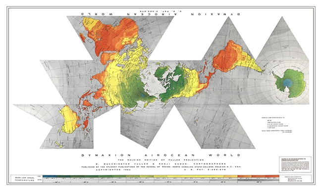

Darkover is/was based on the novels and short stories written by Marion Zimmer Bradley et al. [http://darkover.apiacoa.org/index.en.html](http://darkover.apiacoa.org/index.en.html)

Darkover was run by [Clarissa](ClarissaOfDarkover), an ancient, powerful, and devious sorceress. Darkover was the center of the [Matrix, a blue crystal power of Life Magic](PowersBalancesAndOpposites).

During the course of the game run Darkover was razed by a suicide force from [Chaos](CourtsOfChaos).  [Princess Chandra](PrincessChandraOfAssassins) and [Pharaban](PharabanOfPharaban) were the two survivors of that strike; Imagio of the [Psionicists](ChaosGuilds) and [Bella](BellahquistOfJesby) were two notable fatalities. During the strike, [Clarissa](ClarissaOfDarkover) called upon all the power she had at her disposal, including all the [Grey Spheres](GreySphere) available to her, and the life-force of all of her descendants she could reach.  Amongst those used up by her in this combat were [Fiona](FionaOfOberon), [Bleys](BleysOfOberon), [Brand](BrandOfOberon), [Celeste](CelesteOfBleys), [Rhiannon](RhiannonOfFiona), [Desilira](DesiliraOfBrandt), [Charynna](CharynnaOfBrandt), [Valdyn](ValdynOfFaythe), [Roberto](RobertoOfBrendhyn), and [Alicyna](AlicynaOfBrendhyn). After the suicide force's strike succeeded [Clarissa](ClarissaOfDarkover) was unmade by [Shiryu](RealmsMasterShiryu) for the good of the Garden.

Darkover is now run by [Faythe](FaytheOfCeleste), and the [Saviour of Chaos](IlkandacianOfCara) has imported a few cities to repopulate it.  Just prior to the [Shadow Purge](ShadowPurge), [Ilk](IlkandacianOfCara) brought over the entire crust and atmosphere (intact) from the planet where the [Count of Cagliostro](CountCagliostro) lived.  The crust was spread out over a (hopefully) unpopulated area of Darkover, and a twelve-mile ramp was constructed to desert level.

Map:

[More information](https://github.com/mrdkap/Amber/blob/master/info/shadows/echoes_of_avalon.md)

The [Sea of Thought](SeaOfThought), mostly but not entirely composed of members of the [Philosophers](PhilosophersGuild) [Guild](ChaosGuilds), has also been migrated to Darkover.  It sits near the base of the ramp connecting the crust to the desert.

[Serpent's Apprentice](IlkandacianOfCara) brought a city controlled by [Samantha](SamanthaOfHubert) to Darkover, and she has continued to manage it there. The city was higher technology than the rest of Darkover, and after its migration was known as "Terra Port" (at least by [Faythe](FaytheOfCeleste)).

[Osric](OsricOfChanicut) towed the entire promontory across the [Sea of Chance](SeaOfChance) to be much more proximate to [Chaos](CourtsOfChaos) just post the [Shadow Purge](ShadowPurge).
