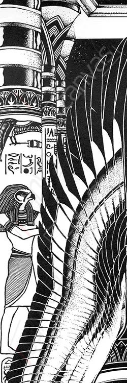

Gwen appeared as a winged woman, usually wearing sunglasses.  She was the daughter of [Dworkin](DworkinOfAmber) and [Clarissa](ClarissaOfDarkover).

Gwen's apparent goal was rulership of the universe, and she came quite close to it.

Gwen acted as [Brand's](BrandOfOberon) tutor, and placed control mechanisms in his mind (as well as other people's). From some perspectives, Gwen was responsible for [PatternFall](PatternFall).

Fun facts about Gwen:
 + She stole Dalkantyr from her [mother](ClarissaOfDarkover)
 + She had the highest known access to the [Reality Engine](RealityEngine)
 + She managed to set up reality so that anytime someone said her name, white dust dropped in, calcifying the [shadow](ShadowPlaces).

Gwen was defeated multiple times, and recovered from all but the last one:
 + Gwen was sliced into parts with a [Pattern Blade](PatternBlade), but the parts crawled off.
 + A suicide mission from [Chaos](CourtsOfChaos) attacked her power base in [Darkover](DarkoverPromontory) after [Shiryu](RealmsMasterShiryu) unmade [Clarissa](ClarissaOfDarkover). [Celeste](CelesteOfBleys) and [Brand](BrandOfOberon) fought against them, possibly because of Gwen's control.  The only survivors of the Chaosian mission were [Princess Chandra](PrincessChandraOfAssassins) and [Pharaban](PharabanOfPharaban).
 + At the same time, another large mass of powerful people invaded her laboratory and killed her in the reality that became known as [Pride's Folly](PridesFolly)
 + Her contingency plans in the RealityEngine brought her back in [Vanir's Wrath](VanirsWrath), where she was defeated again in a city of angels.
 + At this last defeat, [Princess Chandra](PrincessChandraOfAssassins) placed Gwen's soul in a [Serpent scale](SerpentOfChaos).

Gwen is currently presumed to be still dead, but to make sure [King](KingOfAmber) [Deirdre](DeirdreOfOberon) is leading an "Anti-Resurrection Hunt" across all known spaces.

