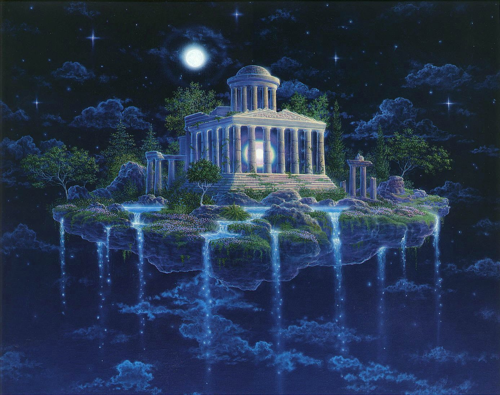

The area lumped together as "Amber" rests on the Kolvir [Promontory](Cosmology) (which in turn is supported by a 'kraken', not a Serpent.)

## Amber-that-is

[King](KingOfAmber) [Deirdre](DeirdreOfOberon) reigns over Amber, and Auricle is the new Dworkin.  A primal [Jean](JeanOfFlorimel) with UberMjolnir is the Steward of Amber.

The former Amber City and Amber Castle - and their surroundings - have been pushed out into Shadow and are now known as [Greater Arden](GreaterArden) and protected by [Zack](ZachariasOfJulian).

The space that houses the first pattern reflecton looks like:

And it is guarded by someithing similar to The Mazing/Queen's Hendge from Girl Genius (Starting at: [The Queen's Henge](https://www.girlgeniusonline.com/comic.php?date=20181203)).

Auricle's new [Primal Pattern](NevilleAuriclePattern) is still protected by the replacement Wixer designed by [Jean](JeanOfFlorimel) and [Ilk](IlkandacianOfCara), then made real by [Logrus Master Suhuy](LogrusMasterSuhuy) and [Dworkin](DworkinOfAmber).  Parts of the new Wixer were designed by other people, including [Snarsht](SnarshtOfBeastmasters).  One of Wixer's armaments is [Dworkin-Brau](DworkinBrau).

## Amber-that-was

Before the original Primal Pattern was erased, "Amber" included:

+ <a name="primalkolvir">Primal Kolvir</a>
  + The location of the [Primal Pattern](PrimalPattern), a slow and primal location where few powers work.  The true underpinning of this side of reality, and not well known at all.
  + The [Primal Pattern](PrimalPattern), protected by the replacement Wixer after the original Wixer was slain by Brand during Patternfall.
+ <a name="shadowkolvir">Shadow Kolvir</a>
: "One shadow over", what most people mean when they say "Amber".
  + <a name="castleamber">Castle Amber</a>
    + Seat of the [King of Amber](KingOfAmber), a sprawling manse reinforced with pattern by [Dworkin](DworkinOfAmber)
    + Castle Amber was the home of the [Kolvir Pattern](KolvirPattern) until that pattern was taken by [Oberon](OberonOfDworkin), then yanked out and unwalked by [Ferro](FerroOfDworkin)
    + The place Trump for Castle Amber goes to the courtyard, which is extensively trapped.
  + <a name="ambercity">Amber City</a>
    + A smallish seaport city near the castle, devastated by a number of disasters, rebuilding planned by [Neville](NevilleOfEric)
    + There is a bar in Amber City that is still open; people who go in don't tend to leave, so they apparently haven't noticed the problems.
    + [Realms Master Shiryu](RealmsMasterShiryu) moved [House Helgram](HouseHelgram) to Amber City; the order-tolerant members of [Neville's](NevilleOfEric) house live there.  (Most of the rest did not survive the transition.)
  + <a name="tir">Tir-na Nóg'th</a>
    + Now missing, this Moon-potent city only showed up at certain times, attached to a stair of rocks.  It was the place that the [Tir Pattern](TirPattern) was anchored to.  A place of visions, dreams, and possiblities.  Possibly a connection between other Chords.
  + <a name="rebma">Rebma Castle and City</a>
    + Originally a perfect reflection of Amber's castle and city when the [Rebma Pattern](RebmaPattern) first came into existence, it has grown and changed over the years.
    + Under the sea, there was a sharp line as to where the limits of Rebma was. The pressure wall of the ocean was quite strong and breathing - while not a problem in Rebma for oxygen breathers - was much more of a challenge.
    + At various times more or less loyal to whomever was [King of Amber](KingOfAmber).
    + The destruction of Rebma was quite a tragedy.  There are still some vendettas and unhappy people who have great losses from that event.

The paths into Shadow Kolvir included the sea lanes and the [Forest of Arden](ForestOfArden), as well as the [Vale of Garnath](ValeOfGarnath).  Both of which were, indeed, on this promontory.

Most of the [Golden Circle Kingdoms](GoldenCircleKingdoms) fell to the shores of Kolvir Promontory after the [Shadow Purge](ShadowPurge), and were helped by [Neville](NevilleOfEric), when he was [Amber's king](KingOfAmber).

The [Golden Circle Kingdoms](GoldenCircleKingdoms) were essentially depopulated by [Gwen's](GwenOfDworkin) madness-inducing white dust, and were repopulated by [Neville](NevilleOfEric) during [Evil Benedict's](EvilBenedict) reign. [Neville](NevilleOfEric) tried to massage the kingdoms to be part of the Amber "shadow", since it's all the same [promontory](Cosmology).

When the Pattern was redrawn, the new Pattern and its reflection(s?) is on Kolvir but the former City and surrounding area were pushed some distance away.
