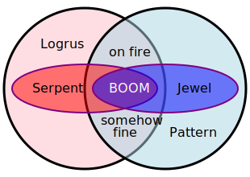
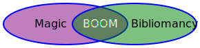

## Powers

Over the course of two decades of Amber gaming, the players have learned, encountered and even created a wide variety of different major Powers.  These powers can be in opposition (explosives reaction when joined, like Pattern/Logrus) or in balance (no kaboom). Many of these powers are represented by a sigil drawn as a focus for that power, generically known as a Squiggle. Many squiggles have a custodian that is the focus and manager of that power, as Dworkin is to the Pattern and Suhuy to the Logrus.

This is a quick summary of powers as understood by the players, so expect incomplete information and possibly incorrect theories.

## List of Known Powers:
 + **Beastmastery** is changing your own or someone else’s true form.  The head of the [Beastmaster’s](BeastmastersGuild) [Guild of Chaos](ChaosGuilds) is the cat [Snarsht](SnarshtOfBeastmasters), and the necromancer [Norton](NortonOfBeastmasters) makes extensive use of Beastmastery.  There might be a link between Beastmastery and Conjuration, but, only the [Sea of Thought](SeaOfThought) has speculated on it, without any actual working tests, or models yet.
 + **Bibliomancy** is the power of forcing things to become true by reading/writing them.  [Jean](JeanOfFlorimel) has rewritten himself so that he cannot see anything that could be bibliomantic.  [Caelin](CaelinOfLaetatio) is a major proponent of this power, his alternate-reality duplicate the Archivist is even more so.
 + **"Blucite"** was a power used by [Llewella](LlewellaOfOberon) and [Gwen](GwenOfDworkin) but poorly understood by the players. It is perfectly insulating and perfectly reflective and only [Llewella](LlewellaOfOberon) knows how to cleanly remove Blucite. Players have destroyed it by exposing it to its opposite, Fringe. The current "best" theory is that Blucite is time-stopped Rebman water, which might be a problem now that Rebma is gone.
 + **Conjuration** is the art of creating something new out of the shadowstuff (or reality, depending on how skiled you are) around you, or making something that already exists more Real.  Deconjuration is not the removal of that thing, but the randomizing of said thing into local bits. Sometimes the deconjuration happens with a bang, or a flash of light, depending on how fast/how far the effect is pushed, and the skill of the conjurer.
 + **Faerie** power includes glamour and faerie gates, but is not widely available.  Known practitioners include [Queen Titania](TitaniaOfFaerie), [Zach](ZachariasOfJulian) and [Ivy](IvyOfJulian).  It might also be a Promontory.  It might also just be a person.  It's ... unclear. 
 + **[Fringe](TheFringe)** is the power running a series of [gates and platforms](FringeGate) that interconnect various shadows, and can also be used to create crystalline objects and shields.  Fringe was developed by the Tehrmelern (speculated as a proto Ways and Means Committee), who were later destroyed by the shapeshifting Mellor.   The Fringe was rediscovered by [Osric of Chaos](OsricOfChanicut). See Also: [[1](https://www.tritacgames.com/Fringeworthy.html)] [[2](http://www.panix.com/~sos/rpg/fringe.html)]
 + **[Logrus](TheLogrus)**, the sigil of Chaos.  [Logrus](TheLogrus) can be used to bring things to you from nearby, by casting a tendril to what you want, and pulling it to you, provided you are more sufficiently anchored that it is, to move through [Shadow](ShadowPlaces) by casting a tendril forth, latching onto something more solid than you are and pulling yourself to that thing.  The more skilled you are with [Logrus](TheLogrus), the further or more spicific you can get.  When you get really advances, you can be weilding many micro-tendrils at the same time.  You can also use your [Logrus](TheLogrus) power to conjure tentacles or limbs, to store spell, to power spells, or if sufficiently advanced, grant supernormal sensing of one's surroundings. [Logrus](TheLogrus) is learned by navigating it. A hazard of navigating it is an insanity of one sort or another.
   + **Serpent** power is a more refined version of [Logrus](TheLogrus), analogous to the [Jewel of Judgement](JewelOfJudgement).  Known users of this power are [Suhuy](LogrusMasterSuhuy), [PrincessChandra](PrincessChandraOfAssassins) and the [Serpent](SerpentOfChaos), as well as the [Black Council](BlackCouncil).
 + **Magic** is manipulating energy to move, defend yourself, blow someone else up, or do something useful. Magical spells can be cast on the fly or mostly-precast and ‘racked’ in an object or person.  These spells can potentially be ‘unracked’ and all trigger at once, and the defensive spells may not balance out the offensive ones. Depending on the skill of the spell-weaver, the lynch-pins allowing for a spell to be used can even be set for a non-mage to use. Spells take energy, and once that energy is loosed, and advanced or skillfull mage might be able to shape or redirect the energy of a less-skillful mage.  Some magic is anti-entropic, meaing the longer it is stored, the more energy it might contain.  If the weaving wasn't designed for overly high-levels of energy, or designed with bleeder-valves of some sort, things might go ... less well than hoped, if left for a while.  A squiggle of magic is the [Spiral](TheSpiral), located in [Cobalt](CobaltPromontory), but according to [Ferethyn](RealmsLords)  (http://web.mit.edu/~dskern/www/amber/log001107.txt) it is not the Pole of magic.  Walking the [Spiral](TheSpiral) is not required to become a mage, but it allowed access to a great power source for mages.  Many mages have been known to store power in variousl baubles, beads, buttons, or the like, so they slowly accumulate power that the mage can then use as a battery for a weaving that they mgiht not otherwise have had the power for.  There are many approaches to using magic.  Perhaps, even as many as there are or ever have been practitioners.
 + **Mathematics** is a poorly known power with great utility.  The most common use of Math is to create a duplicate of an object that is -- to use computer lingo -- actually a hard link to the first object.  Both objects are real and both objects are the original.  Math isn’t limited to one duplicate; there are many [Jewels of Judgement](JewelOfJudgement) floating around but “there is only one Jewel”.  There is a [Mathematician’s Guild](ChaosGuilds#mathematicians) in [Chaos](CourtsOfChaos) but the best known practitioner of Math is [Dworkin](DworkinOfAmber).
 + **Matrix** is a formalized life energy, centered in blue crystals located in the [Overworld of Darkover](DarkoverPromontory).  For a long time the custodian of the Matrix was [Clarissa](ClarissaOfDarkover), but it is now her granddaughter [Faythe](FaytheOfCeleste).  Not much us know about what the Matrix can do, [Faythe](FaytheOfCeleste) is slowly exploring that into beaing.  The only major known interaction is when [Chaos](CourtsOfChaos) assaulted [Darkover](DarkoverPromontory) and many skillfulland able Chaosians died.
 + **Pattern**, the sigil of order.  There are many Patterns and reflections of Patterns. Although reflections seem to be their own primal thing, with their own powers, and uniquenesses, unlike mathematic creations.  Pattern is obtained by walking it, and access to the original [Amber Pattern](PrimalPattern) and it's reflections in [Castle Amber's dungeons](KolvirPattern), [Rebma](RebmaPattern), and [Tir na Nog'th](TirPattern) were theoretically limited to the descendants of [Dworkin](DworkinOfAmber).  [Corwin](CorwinOfOberon) drew a [new pattern](CorwinPattern) in his realm of [Argent](CorwinPromontory) with Pearl as it's capital, and a [new Pattern](NevilleAuriclePattern) was drawn in a new Amber after the [old Pattern](PrimalPattern) was erased.  The un-drawing of the pattern was only possible because all of the reflections ([Castle Amber's dungeon Pattern](KolvirPattern), [Rebma's Pattern](RebmaPattern), and [Tir na Nog'th's Pattern](TirPattern)) had previously been removed or erased. Amongst the many powers that the Pattern gifts it's users, traveling through [Shadow](ShadowPlaces) is the most common.
   + **[The Jewel of Judgement](JewelOfJudgement)** has a more refined order power - an octave above, as it were.  [The Jewel](JewelOfJudgement) is accessed by holding it and mentally walking the 3-dimensional pattern as perceived inside.
 + **The Reality Engine** was used by [Gwen](GwenOfDworkin) to do her dirty deeds.  Poorly understood and remembered, this may get filled out more later.  Possibly more info in [Pride's Folly](PridesFolly) and [Gwen The Big Bad](GwenTheBigBad).
 + **Reality Seeds** and **Marbles** are poorly understood sources of power.  We do know that marbles are contagious (touching a marble turns out into a marble) and **Grey Spheres** are somehow three? reality seeds wrapped in each other so they are safe to touch. Beings of power can be stored in Grey Spheres and tapped for power.
 + **Rim Fishing** is the art of reaching out into the [Sea of Chance](SeaOfChance) and pulling from it useful objects, without, mind you, getting pulled in yourself. While one doesn't have to be an [Old Lord](OldLord) to be a rim-fisher or a member of the [Rimfishers Guild](ChaosGuilds#rimfishers) it is unlikely you will survive long if you are not.
    + **Pit Diving** is a similar art to Rim Fishing, except specifically for the (much more survivable) [Abyss](TheAbyss).  In fact, if you just trade with the Demon Houses that inhabit the [Abyss](TheAbyss) you could still claim membership in the [Pit Divers Guild](ChaosGuilds#pitdivers).
 + **Shapeshifting** is changing your own or or someone else’s outer form.  Shapeshifting power is common in the [Courts of Chaos](CourtsOfChaos). The best known shapeshifter is [Rainbow](RainbowOfDancers), the head of the [Dancer’s](DancersGuild) [Guild](ChaosGuilds) of [Chaos](CourtsOfChaos).
 + **Shadow Manipulation** is the ability to shape or change the reality around you. It gets easier provided you have more reality or mystic inertia than that which you are changing does.
 + **Shadow Travel** is crossing the expanse of [Shadow](ShadowPlaces) by some means.  Some of the many ways are: following tracks set down by others; following the elusive trace of someone's passage; magically moving between points; trump usage; walking and shifting by the benefit of Pattern; pulling with Logrus; bibliomantically connecting two points; wandering throught the [Void](TheVoid); using the Reality Engine; using two Faerie Gates; crossing between points on the Fringe; et cetera.
 + **Time travel** is impossible, but apparently time is manipulable by a few.  The [Time Lord](RealmsLords) is Melchizedek, one of the [Realms Lords](RealmsLords) of [Chaos](CourtsOfChaos). There is some indication that Melk is cross-reality and there is only one of him, although he does have an apprentice or two.
 + **Trump** uses images of things to access them, whether forging psychic connections with a person or a temporary gate to a place.  Trump can be powered by any of the other powers, and this power source affects where those Trumps work. Trump is illegal in [Chaos](CourtsOfChaos) but is still secretly practiced there.  The best known Trump artist is the Chaosian known as [Darkstar](DarkStar), but [Dworkin](DworkinOfAmber) is also famous for drawing and providing Trumps for Amberites. 
 + **Undeath** is taking things that were once alive and then died, and reanimating them into a form of quasi-life. It is usually accomplished through Beastmastery. [Norton](NortonOfBeastmasters) is the most widely known master of undeath.  [Mikail](MikailOfOberon) was using undeath to gain prominence in the [Slavers Guild](ChaosGuilds#slavers).
 + **[Unlife](UnLife)** is taking things that were never alive or dead and animating them into a form of quasi-life. Golems and intelligent robots are examples.  The most widely distributed wielder? of Unlife is [Jean](JeanOfFlorimel). 
 + **Unmaking** is a disturbing power held by the [Old Lord](OldLord) [Cemen](CemenTheUnmaker), who can use it to instinctively make something go away.  There is some awful side effect of unmaking that the author has forgotten and will fill in later.  (Don't think about the [Anti-Dragons](AntiDragons).)
 + **[Void](TheVoid)** is the power related to the [Abyss](TheAbyss) and the great emptiness above the sea of chance.  [Fiona](FionaOfOberon) used it to transport [Corwin](CorwinOfOberon) to the [primal pattern](PrimalPattern).  [Rainbow](RainbowOfDancers), [Verra](DemonGoddessVerra), and [Ingold](IngoldOfBenedict) wield this power. 

## Opposing or Balancing

| Powers and balances |
| ------------------- |
|  |
|  |
|  |
|  |

---
More indepth on various powers:

## Faerie


And of course there are the Faerie Dragons:


### Morganti Weapons


## Fringe


## Logrus


### Logrus Blades


## Magic


### The Spiral Explosion


## Pattern

### The Primal Pattern


### The Pattern in the Castle


### The Pattern in Rebma


### The Pattern it Tir


### The New Primal Pattern


### Jewel Of Judgement


### An Alternate (and powerful) Pattern


### The (now gone) SuperPattern


### Corwin's Pattern


### Pattern Blades and Other Artifacts


## Pit Diving


## Unlife


## Void

