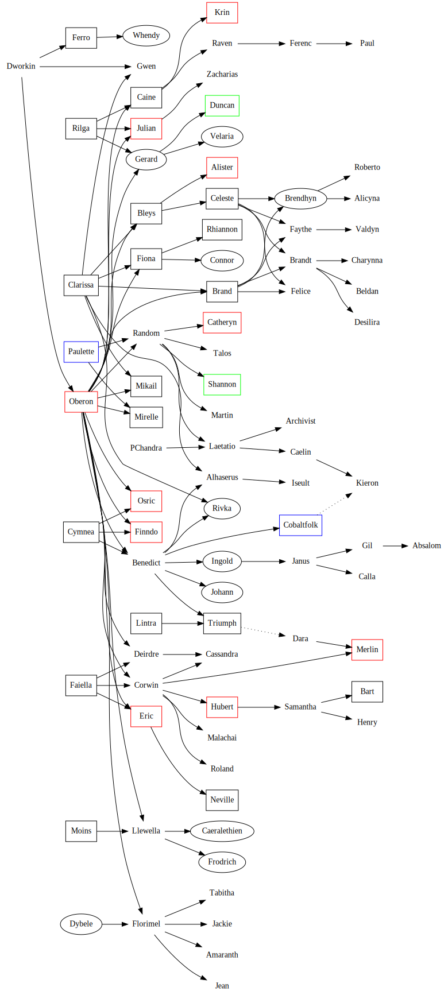

## <a name="familytree">Local Amber Family Tree</a>

This is a dot-generated picture (dot -Tsvg LocalAmberFamily.gv -o LocalAmberFamily.svg) from the [Local Amber Family GV file](LocalAmberFamily.gv).  To expand out the blue "Cobaltfolk" or more information about Paulette or Kieron, see the [Cobaltean Royal Family Bush](CobalteanRoyalFamily).  While the below is (as close to) age order as I can tell (and there are gaps) the [succession list](https://heretek.com/~dkap/Amber/current_inheritance.html) is different.

### <a name="amberitekey">Amberite Key:</a>
 + An oval is missing
 + A black sqare is in a scale of the [Serpent](SerpentOfChaos), or leaf of the Kraken dead.
 + A red square is dead in the [Jewel of Judgement](JewelOfJudgement).
 + A green square is dead in [Norton's](NortonOfBeastmasters) [Head](NortonsHead).
 + A blue square means see also [Cobalt](CobalteanRoyalFamily).
 + First Generation ([Dworkin](DworkinOfAmber))
 + Second Generation (Children of [Dworkin](DworkinOfAmber))
 + Third Generation (Grandchildren of [Dworkin](DworkinOfAmber))
 + Fourth Generation (Great-grandchildren of [Dworkin](DworkinOfAmber))
 + Fifth Generation (Great-great-grandchildren of [Dworkin](DworkinOfAmber))
 + Sixth Generation (Great-great-great-grandchildren of [Dworkin](DworkinOfAmber))
 + Seventh Generation (Great-great-great-great-grandchildren of [Dworkin](DworkinOfAmber))

## Who is Where Amberites

+ [Dworkin](DworkinOfAmber): the [Badgerverse](BadgerVerse) with [Wonder Dworkin](WonderDworkin), [Alice](AliceOfDworkin), [Jean's s Whale](JeanOfFlorimel), and the [whagons](DragonWhales).
 + [Oberon](OberonOfDworkin): [Dead in the Jewel](JewelOfJudgement) killed with malice aforethought.
 + [Benedict](BenedictOfOberon): [Courts](CourtsOfChaos) working for [Cyndia](CyndiaOfBenedict).
 + [Misunderstood (Nee Evil) Benedict](EvilBenedict): meditating somewhere with [Hamster Dworkin](WhoIsWhereHamsterites#Dworkin) and those learning Dworkinetics.
 + [Osric](OsricOfOberon): Presumed dead for the good of Amber, possibly in traying incident.
 + [Finndo](FinndoOfOberon): Presumed dead for the good of Amber, possibly in traying incident.
 + [Eric](EricOfOberon): [Jewel of Judgement](JewelOfJudgement), repeatedly killed by [Norton](NortonOfBeastmasters) most recently.
 + [Rivka](RivkaOfBenedict): (aka Bridget/Paprika) [Sea of Chance](SeaOfChance) by her own volition, to avoid [Oberon](OberonOfCorwin)'s punishment for breaking his laws.
 + [Corwin](CorwinOfOberon) (Clown Prince): [Ygg](YggPromontory) still stomping about and being all pissy.
 + [Corwin](CorwinOfOberon) (Sandy): Ruling [Pearl](CorwinPromontory), and keeping separate.
 + [Ingold](IngoldOfBenedict): Missing in the [Void](TheVoid), and the target of a fishing experiment.
 + [Deirdre](DeirdreOfOberon): Hunting the rumored resurrection (#6) of [Gwen](GwenOfDworkin) in [Pearl](CorwinPromontory), and is currently [King](KingOfAmber) of [Amber](ShadowKolvir) with [Auricle](AuricleOfTir) as Regent.
 + [Hillbilly Deirdre](HillbillyDeirdre): The Goth member of [Hillbilly Amber](HillbillyAmber) made it through to local reality. Whereabouts unknown for some time. Rumored to have been haning out in a restaurant halfway down a cliff face.
 + [Caine](CaineOfOberon): Scaled and Dead for Dragon slaying and destroying an alternate Chaos belonging to the [Winged Wyrm](WingedWyrm).
 + [K'rin](KrinOfCaine): [Jewel of Judgement](JewelOfJudgement), died saving [Caine](CaineOfOberon) (and [Raven](RavenOfCaine)).
 + [Raven](RavenOfCaine): [House Cara](HouseCara) at the party.  Occasionally going outside for a [Warriors'](WarriorsGuild) [Guild](ChaosGuilds) duel to make sure nothing in [Cara](HouseCara) gets broken in the process.
 + [Johann](JohannOfBenedict): (aka Sir Erik) Missing in the [Shadow Purge](ShadowPurge), and so is his donkey.
 + [Alhaserus](AlhaserusOfBenedict): (a.k.a. The Wandering Jew)  In [Darkover](DarkoverPromontory) doing world-settling logistics.
 + [Fiona](FionaOfOberon): Used up by [Clarissa](ClarissaOfDarkover) defending [Darkover](DarkoverPromontory) as a [Grey Sphere](GreySphere).
 + [Bleys](BleysOfOberon): Used up by [Clarissa](ClarissaOfDarkover) defending [Darkover](DarkoverPromontory) as a [Grey Sphere](GreySphere).
 + JanusOfIngold: [Darkover](DarkoverPromontory) doing world-settling logistics.
 + LlewellaOfOberon: Blinded, muted, spayed, cut off from all power sources possible, and awaiting her fate after trying to take over the [Courts](CourtsOfChaos).
 + BrandOfOberon: Used up by [Clarissa](ClarissaOfDarkover) defending [Darkover](DarkoverPromontory) , after dying by falling into the [Abyss](TheAbyss), being resurrected by [Celeste](CelesteOfBleys) as possibly the first rescue from the [Jewel](JewelOfJudgement).
 + [Neville](NevilleOfEric): (a.k.a. [King](KingOfAmber) Eric II of [Amber](ShadowKolvir) and the Great Savior of the [Golden Circle Kingdoms](GoldenCircleKingdoms)) Died in the Pattern Redraw at the end of the [Shadow Purge](ShaodwPurge). Theoretically in the eye-socket of the [Serpent](SerpentOfChaos), to be reunited with family when the [Eye of the Serpent](JewelOfJudgement) is returned.
 + [Florimel](FlorimelOfOberon): (Flora) The [Courts of Chaos](CourtsOfChaos) last seen helping restructure [The Courts](CorutsOfChaos).
 + IseultOfAlhaserus: [Darkover](DarkoverPromontory) at the AngryChildrenTea.
 + [Julian](JulianOfOberon): [Jewel of Judgement](JewelOfJudgement), although he's been killed a few times now.
 + [Gerard](GerardOfOberon): Missing in the [Shadow Purge](ShadowPurge).
 + NazirdinOfIngold: [Darkover](DarkoverPromontory) doing world-settling logistics.
 + [Zacharias](ZachariasOfJulian): (Zach) [Amber](KolvirPromontory#shadowkolvir) helping re-stablize the [Golden Circle](GoldenCircleKingdoms).
 + RandomOfOberon (both): [Cobalt](CobaltPromontory) talking to/with himself, and anyone else he can weird out, with his wife VialleOfRebma.
 + [Celeste](CelesteOfBleys): Used up by [Clarissa](ClarissaOfDarkover) defending [Darkover](DarkoverPromontory).
 + MirelleOfOberon: Presumed dead after walking the pattern badly.
 + MartinOfRandom: [The Egg Place](EggPromontory) helping with the hatching and the teaching, and keeping Al-NazirOfNazirdin in line.
 + GilOfJanus: [Darkover](DarkoverPromontory) doing world-settling logistics.
 + LaetatioOfRandom: HouseMoonlight.
 + RhiannonOfFiona: Used up by [Clarissa](ClarissaOfDarkover) defending [Darkover](DarkoverPromontory).
 + ConnorOfFiona: Was in the garden of [Castle Amber](ShadowKolvir) as a massively time-slowed statue, but went missing sometime during [Evil Benedict's](EvilBenedict) reign as [King](KingOfAmber).
 + TabithaOfFlorimel: [Darkover](DarkoverPromontory) at the AngryChildrenTea.
 + ArchivistOfLaetatio: HouseMoonlight running the house as house second. 
 + [Malachai](MalachaiOfCorwin): [Pearl](CorwinPromontory).
 + CaelinOfLaetatio: CobaltPromontory dealing with the wearing of the reality there.
 + CaelinOfLaetatio (backup copy): [Grey Sphere](GreySphere) on the desk of [Princess Chandra](PrincessChandraOfAssassins) in the AssassinsGuild.
 + (ex-) CaelinOfLaetatio: SeaOfChance and expiated due to a fungo-bat.
 + AlisterOfBleys: JewelOfJudgement.
 + AbsalomOfGil: [Darkover](DarkoverPromontory) doing world-settling logistics.
 + VelariaOfGerard: Whereabouts Unknown.
 + [Al-Nazir](AlNazirOfNazirdin): [Darkover](DarkoverPromontory) doing world-settling logistics.
 + TalosOfRandomAdopted: [Darkover](DarkoverPromontory) at the AngryChildrenTea.
 + JackieOfFlorimel: [Darkover](DarkoverPromontory) at the AngryChildrenTea.
 + DaraOfOfOfBenedict: CourtsOfChaos in the care of the healers guild?
 + TheraatOfVale: Whereabouts Unknown. Theraat is originally from an alternate universe; her father Vale is the son of that CaineOfOberon.
 + FaytheOfBrand: FerethynsWays at tea.
 + FeliceOfBrand: FerethynsWays at tea.
 + MikailOfOberon: In a scale, held by [Shiryu](RealmsMasterShiryu) for later study.
 + BrandtOfBrand: CourtsOfChaos outside the door that LlewellaOfOberon is behind.
 + [Brendhyn Hastur](BrendhynOfBrand): Missing, orchestrated by LlewellaOfOberon.
 + MerlinOfCorwin: Blown to bits in the [Spiral Explosion](SpiralExplosion).
 + AmaranthOfFlorimel: [Darkover](DarkoverPromontory) Running the [Mages](MagesGuild) [Guild](ChaosGuilds).
 + CathrynOfRandom: JewelOfJudgement, after [Gwen](GwenOfDworkin)'s guardian hound was gated into her room in Rebma.
 + DesiliraOfBrandt: Used up for [Clarissa](ClarissaOfDarkover) defending [Darkover](Darkover Promontory).
 + ValdynOfFaythe: Used up by [Clarissa](ClarissaOfDarkover) defending [Darkover](DarkoverPromontory).
 + RobertoOfBrendhyn: Used up by [Clarissa](ClarissaOfDarkover) defending [Darkover](DarkoverPromontory).
 + CassandraOfCorwin: [Pearl](CorwinPromontory).
 + CharynnaOfBrandt: Used up by [Clarissa](ClarissaOfDarkover) defending [Darkover](DarkoverPromontory).
 + AlicynaOfBrendhyn: Used up by [Clarissa](ClarissaOfDarkover) defending [Darkover](DarkoverPromontory).
 + JeanOfFlorimel: Everywhere.
 + PaulOfFerenc (skatepunk): [Darkover](DarkoverPromontory) doing world-settling logistics.
 + KieronOfCaelin: SerpentsAntechamber being babysat.
 + FerroOfDworkin: Died in the Pattern Redraw at the end of the [Shadow Purge](ShaodwPurge). Theoretically in the eye-socket of the [Serpent](SerpentOfChaos), to be reunited with family when the [Eye of the Serpent](JewelOfJudgement) is returned.
 + BartOfSamantha: Smear on the floor of the [Assassans](AssassinsGuild) [Guild](ChaosGuilds) thanks to the [Black Council](BlackCouncil).
 + WhendyOfFerro: Missing in [Shadow Purge](ShadowPurge).
 + DuncanOfGerard: NortonsHead dead, but there anyway.
 + HenryOfSamantha: [Darkover](DarkoverPromontory) helping his mother, and in day-care.
 + ShannonOfRandom: NortonsHead dead, but there anyway.
 + BeldanOfBrandt: Soul entangled with [Kipo](CobalteanRoyalFamily#kipo) before birth, so with the children of [Cobalt](CobalteanRoyalFamily.md).

## Currently unknowable age order:

 + AuricleOfTir: [Greater Arden](GreaterArden) (or just pulled away into something ... as usual).
 + CountCagliostro: [Darkover](DarkoverPromontory) doing world-settling logistics.
 + [Mistress Janice](JaniceOfCagliostro): [Darkover](DarkoverPromontory) doing world-settling logistics.

## I don't know the age-order of these ... help?

 + [Gwen](GwenOfDworkin): In the process of Resurrection Number 6 (Unless [King](KingOfAmber) [Deirdre](DeirdreOfOberon) has a say in the matter. (Somewhere between Brand and Mikail)
 + HubertOfCorwin: In the [Jewel of Judgement](JewelOfJudgement) awaiting re-construction by [Norton, Court Necromancer](NortonOfBeastmasters), disassembled at the [Assassans](AssassinsGuild) [Guild](ChaosGuilds) by the [Black Council](BlackCouncil). (While Corwin didn't have his memory on Shadow Earth I believe)
 + RolandOfCorwin: [Darkover](DarkoverPromontory) doing world-settling logistics. (From another chord, so hard to tell)
 + SamanthaOfHubert: [Darkover](DarkoverPromontory) running her city, Terra Port. (Not that far in the past, since she thinks herself not overly old for a human, well within her peers age.)
 + FrodrichOfLlewella: Missing in [Shadow Purge](ShadowPurge).
 + CaeralethienOfLlewella: Missing in [Shadow Purge](ShadowPurge).
 + CallaOfJanus: [Darkover](DarkoverPromontory) doing world-settling logistics. (check with the player)
 + FerencNadasdyOfRaven (vampire): [Darkover](DarkoverPromontory) doing world-settling logistics. (Have to figure out Norton's timeline, and when Raven might have been fighing with K'rin)
 + [Gerard](GerardOfOberon)'s as yet unnamed "evil" son: Missing in the [Shadow Purge](ShadowPurge).
