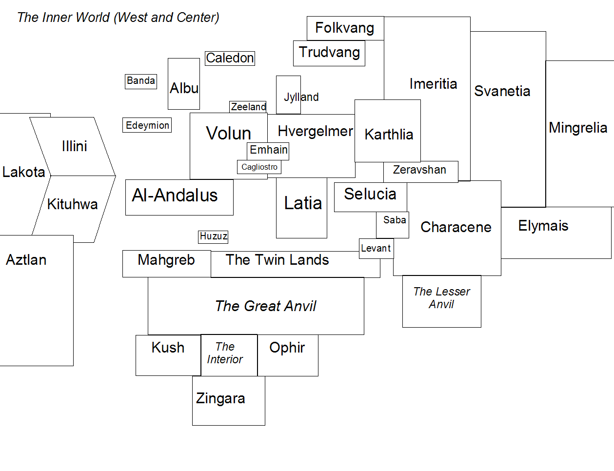
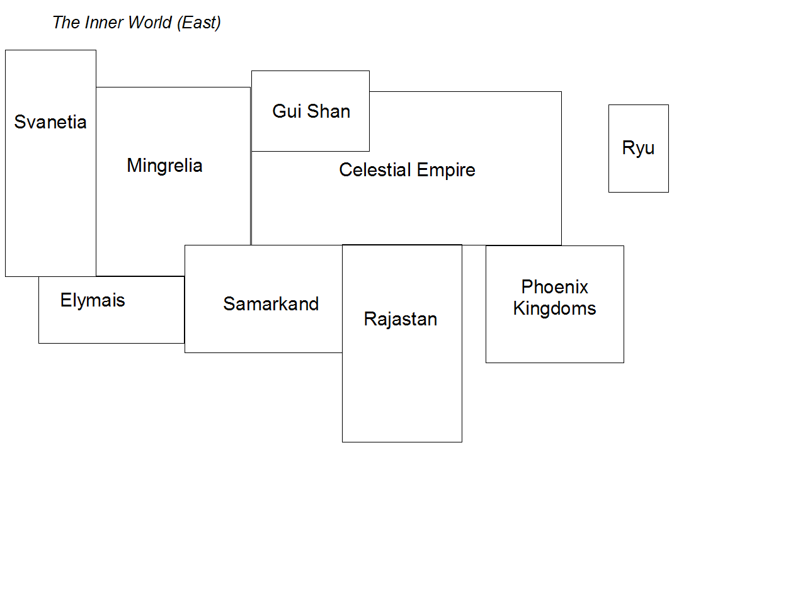

Echoes of Avalon (Corwin's Empire, 1500 years later)
====================================================

Last Updated: 6 May 2007

The Inner World
---------------

The Earth-that-was, a Shadow of Avalon skinned like a orange and
moved to Darkover to avoid the ShadowPurge. 
The center of the Inner World is the Central Sea.

The Inner World is on planetary crust two miles high above the desert floor and separated from the Outer World by
a black energy wall high enough to trap in water vapor. There is a gap
in the wall in the Great Anvil that opens to a twelve-mile long ramp
down to the desert of the Outer World.

### Geography:

There are four major land divisions, two oceans, and one inland sea:

-   **The Western Ocean (a'Chuain Siar)** - dividing the Northern and
    Southern lands from the Western Lands

-   **The Ocean of Tranquility** - separating the Western Lands from the
    Silk Kingdoms. Its name is an appeal to the gods; this fierce ocean
    is rarely tranquil.

-   **The Central Sea** - a saltwater sea connected to the Western Ocean
    at its western strait, stretching east to the Levant, separating the
    Northern and Southern lands.

-   **The Northern Lands**

-   **The Southern Lands**

-   **The Eastern Lands**

-   **The Silk Kingdoms** (far to the east)

### North of the Central Sea

The northern part is European, but less Roman and more Celtic and Norse.
In contrast to Shadow Earth, there is still more of an oral tradition,
with particular emphasis on mysteries, myths, and secret lore.\
\
Seeds from the ashes of Corwin's Empire of the Keltoi-

-   **Albu** (Avalon's Island), northwest of the continental
    Northern Lands.

-   the smaller island of **Banda**, west of Albu. The Keltoi of Banda
    are hard-drinking mystics.

-   **Caledon** – an island of rugged highlands and lochs, a fierce and
    insular people.

-   the continental kingdoms, starting
    with **Emhain** – a peninsula stretching into the Western
    Ocean south of Albu,  once home to the druids.

-   **Edeyrnion** – A thousand years ago, its rolling hills were covered
    with trees. In present days, it is a source of coal and metals for
    neighboring kingdoms. Its caers, particularly the capital Caer Rhun,
    are a mixture of dirty and quaint.

-   **Volun** – the largest of the continental Keltoi kingdoms, Volun
    borders Emhain to the southwest, Caledon to the north, Hvergelmer to
    the east, Latia to the southeast, and Cagliostro nestled between
    Latia and Emhain. The Volunti calendar and measuring system have
    replaced older, more arbitrary systems.\
    Napoleon Bonaparte once ruled Volun and almost the world...

-   **Zeeland** – A nation of traders, famous for its seafaring and
    exploring past.

<!-- -->

-   **Latia** – the home of the Latins, who founded an ever-expanding
    military empire until the foundation of Avalon. Even after Avalon's
    fall, the Latins never recovered their former glory and momentum.

-   **Selucia** – Mountainous lands with an agricultural economy based
    on olive trees, an ancient cradle of civilization and philosophy
    whose time has come and gone.

-   **Cagliostro** – a minor country the size of a postage stamp,
    located in the mountains on the border of Latia, Emhain, and Volun.

-   **Folkvang** – remote Nordic country, famed for fjords and reindeer

-   **Hvergelmer** - wooded Germanic country, rumored location of a well
    of wisdom. Local mythology has it that a dragon chews on the roots
    of the trees, which suffer from periodic mysterious blights.

-   **Jylland** – the southernmost Nordic country, located on a
    peninsula north of Hvergelmer

-   **Trudvang** – Nordic country built around the river Sökvabäck which
    flows down a peninsula, fed by glacier melt.

There is a mutual defense treaty between most of the kingdoms north of
the Central Sea, that also includes the powerful Illini and Kituhwa
nations across the Western Ocean.

### South of the Central Sea

A vast desert divides the self-described "enlightened" Lands of Fate
from the mysterious Countries of Gold further to the south and farther
from the Central Sea.

-   **Al-Andalus** - Great explorers, the people of Al-Andalus were the
    first from these lands to cross the western ocean and 'discover' the
    inhabitants there. Many people in the Western Lands still bear a
    grudge against the Andalusians for their plunder and harsh
    initial contact. Al-Andalus controls travel from the Western Ocean
    to the Central Sea.

-   **Huzuz** - Off the southern coast of the Central Sea, the island
    city of Huzuz is a hotbed of intrigue considered by many
    (particularly south of the Central Sea) to be the finest city in
    the world.

-   **Maghreb** - Mahgreb stretches south to the Furrowed Mountains,
    which form the border with the Great Anvil. The Pheni, originally
    from the Levant, founded Mahgreb, although their first capital
    (New City) was destroyed in three disastrous wars with Latia.

-   **The Twin Lands** - ancient land, source and repository of
    tremendous wisdom and mystery

-   **The Great Anvil** - the vast desert that acts as a boundary
    between the countries tied to the Central Sea and the Countries
    of Gold.

-   **The Countries of Gold** - Strange countries as well as remote
    jungle, still mysterious, little explored, with strange beasts. The
    three best known are Kush, Ophir, and the coastal kingdom
    of Zingara.

### East of the Central Sea

-   **Levant**, home to the mountain city Megiddo - sited at a trade
    crossroads, and prophesied to be the site of a battle to decide the
    fate of the world. The legalistic and patriarchal warrior culture of
    the Levant has frequently come into conflict with the
    Sabean matriarchy.

-   **Saba** - a matriarchy whose virgin queen rules over the Sabeans.
    The economy of Saba is based on trade, and the morality of its
    traders and inhabitants is often questioned by foreigners. Sabean
    mystics are renowned for their knowledge of astronomy, astrology,
    and divination.

### "The Western Lands" (N, S, and Central America)

-   **Aztlan** (a citizens is an "Aztecatl") in the central Western
    Lands, stretching north and to the west. Aztlan has many trading
    connections with the Silk Kingdoms. Sorcerers and priests in Aztlan
    have rejected (at least publicly) human sacrifice since the Blood
    War, although non-fatal blood magic is still practiced.

-   the **Illini Confederation** in the Northeastern Part of the Western
    Lands (Illiniwek), an agrarian democracy with a proud tradition of
    liberal thought and political experimentation.

-   **Kituhwa** (citizens - Ani-Kituhwagi) located south of Illini, the
    easternmost of the Western Lands. The Ani-Kituhwagi are the most
    Gaelic/Roman influenced of the Western peoples, industrial
    and industrious.

-   **Lakota** - warrior nomads in the Spirit Plains.

-   **Manitoba** - the kingdom of Manitoba is a hybrid of Celtic and
    Western culture, ruled by the eccentric King Louis from his capital
    at Red River. The kingdom of the Manitou contains both prairies
    and mountains.

### The Eastern Lands

Slavic lands, steppes, arctic places and warmer ones. East of the
Northern Kingdoms, Saba and the Levant.

-   **Imeritia**, **Svanetia** and **Mingrelia** - the three successor
    states of the **Khazar Khanate**, which fragmented a generation ago
    during the Long War. Centuries ago, raiding warrior families of Gui
    Xian conquered the land that became Khazar Khanate and set
    themselves up as the new ruling class over a nation of serfs.
    Industrialization and the pressures of a failed war led to the
    fragmentation of the feared Khanate into three successor states.

-   **Karthlia** - a country rich in minerals and hydroelectric power,
    with a history of being occupied or subjected to greater powers.

-   **Zeravshan** - A fertile river valley bounded by staggeringly
    tall mountains.

-   **Characene** - the western half of the Golden Bridge from the old
    Celtic lands to the Silk Kingdoms. Characene has a long history of
    rivalry with Selucia.

-   **Elymais** - the eastern half of the Golden Bridge, which extends
    to the mountainous wilds that separate the Eastern Lands
    from Rajahstan.

    -   The city of Gandhara was sorely abused during its conquest and
        occupation

### The Silk Kingdoms

Far to the east are the Silk Kingdoms

-   **Samarkand** - the Westernmost silk kingdom, traditionally balanced
    between the Silk and Eastern kingdoms. It was invaded by its eastern
    neighbor Rajahstan a generation ago, but has recovered with
    redoubled energy and drive.

-   **The Celestial Empire** - terraced rice fields, ancient traditions,
    and an inward-turning gaze greatly disturbed by the war with
    Rajahstan

-   **Gui Xian** - Northern Kingdom of the Black Tortoise, armored
    warriors. 

-   **Rajastan** - a southwestern Silk Kingdom called the "Tiger
    Kingdom", formerly warlike Aryans who attempted to conquer the world
    but were driven back, conquered, and subdued. Rajahstan was divided
    into Sunrise (East) and Sunset (West) Rajahstan, and the two sides
    are now discussing reunification.

-   **Ryu** - the Dragon Kingdom, a collection of warlike fiefs on
    island archipelagos that unified a century ago in the face of
    external threats. Ryu is east of the Celestial Empire and the
    northern Phoenix Kingdoms.

-   **The Phoenix Kingdoms** - to the south of the Celestial Kingdom,
    the seven major and countless minor Phoenix Kingdoms are on the
    coasts of peninsulas and islands in the Jacinth Sea - rulership
    frequently changes hands, and they are considered backwards
    and fractious.

The Outer World:
----------------

The Outer World is a remarkable place. From least to most remarkable:

-   It is a barren, featureless desert

-   There are three suns

-   The suns do not set, and one sun is perpetually at the apex

-   The world is flat

-   There appears to be a dome over the world, which can be used to
    bounce radio waves

The Calendar:
-------------

For almost two thousand years, the Latian Grigori calendar and the
Celtic lunar calendar competed for primacy. (The Celtic calendar
measured time since Avalon's founding, but the start of the calendar
itself started seven years too early.)

After the Volunti Revolution two hundred and eleven years ago, the
cleaner Revolutionary Calendar was created. This calendar, with twelve
thirty-day months and five celebratory days at the end of the year, was
gradually accepted, and is now the de facto international standard.

History:
--------

The history of the world involves less “westernization” of the other
continents, which progressed in their own fashion with Gaelic and Roman
'civilized influences'.

### Rise of the Latin Empire:

A Kingdom, then a Republic, and finally an Empire of the One God. The
greatest empire the world knew since Alexander; for centuries, it seemed
its expansion would never end.

### Corwin's Reign and Fall:

Corwin's analog founded a Gaelic-speaking empire of Keltoi that rolled
back the Latins. ("Corwin" - "From beyond the hill".) His birth is a
mystery, but he was accepted as Uther's heir.  The empire was focused on
the northern shore of the Central Sea, but started on an island in the
Western Ocean (a’Chuain Siar).

While founding his kingdom and before the famed Silver Towers were built
in Avalon, Corwin fathered a son on the enchantress Dierdre Le Fay. Le
Fay - said by some to be Corwin's half-sister -  raised a blackguard and
a pirate famed across the land, the blackbearded Teachtaire. Later,
Corwin married a young and beautiful princess of the Emhain named
Gwenhwyfar, uniting her fractious and mystically powerful people with
his growing empire. The poets say that Corwin  died of a broken heart
when his wife Gwenhwyfar left him for his bastard son, Blackbeard.

Historians say that "Captain" Teach and Gwenhwyfar split Corwin's
kingdom in half, leading to a great battle on the Field of Thorns.
During the battle, Corwin and his son met in a mighty duel in which both
are presumed to have died. Dreamers say that Corwin did not die, but
instead went to Tír Ildáthach (the Many-Colored Land) to heal, and will
return in the time of his people's greatest need.

### Three Heirs to Avalon:

Tradition holds that Corwin had three children, and each of these
children represented a path that the world could travel on:

1.  "Lainn" (falcon) or Emperor Falco \[Merlin\] - the unlucky heir,
    presided over the collapse of Corwin's celtic empire

2.  Fáith (prophet) \[Cassandra\] The younger sister, well-loved by
    the people. There is still a sizable cult that teaches that if Fáith
    has been the heir instead of Lainn, the Empire would never
    have ended.

3.  Teachtaire (Captain Teach) \[Malachi\] (bastard son, pirate
    - "Blackbeard") (son with Corwin's half-sister, Darcy la Fay
    ('sorrow' or 'dark')

History holds that Corwin and his bastard son slew each other in their
great battle at the Field of Thorns. Lainn, Corwin's legitimate son,
became Emperor Falco in Avalon after the great battle. He proved
inadequate to the task of ruling Corwin's empire, which was torn apart
by internal divisions and external threats – the Silver Towers
collapsed.

After his wife's betrayal, Corwin persecuted the druids, the leaders of
the Old Way of the Keltoi, practiced by Gwenhwyfar and many Emhain. The
druids suffered even more under Lainn's reign, and much of their lore is
lost. The Latins never recovered their momentum, however.

### The Inquisition:

The Inquisition was founded almost a thousand years ago in Latia to deal
with the problem of the "purification" heresy, the so-called Catharsis.
Over time, the Inquisition spread to deal with heretics in other lands,
particularly those who refused to accept the primacy of the Latin Mother
Church. The Inquisition also dealt with organizations that were viewed
as subversive, especially the explosion of mystic secret societies four
hundred years ago.

The Inquisition was officially abandoned, but there are rumors that a
secret sect of the Latin Mother Church continues its work.

### The Flowering:

Centuries after the darkness that followed Avalon's fall, a great
rediscovery of technology and innovation swept Latia, spreading quickly
out to the Northern Lands and beyond. The Old Ways of magic and
superstition had been crushed (or driven into hiding) by Corwin or the
Inquisition.

The Flowering's great discoveries coupled with a zest for
experimentation had both great and horrific results.

### Discovery of the Western Lands:

Near the end of the Flowering, three ships sailing the Western Ocean
found an undiscovered country. The Al-Andalusians were particularly
interested in the vast quantities of gold in the Western Lands, and
followed their voyage of discovery with conquest and plunder. These
attempts - and later stabs at colonization - were moderately successful,
until they triggered a coalescence in the Western Lands. The hundreds of
tribes and peoples united into a handful of nations, and those states
made conquest uneconomical.

A few remnants of colonialism remain, with varying degrees of
prosperity. The most prosperous of these remnants - until recently - was
the free city of New Amsterdam.

### The Terror:

An idealistic revolution in Volun against the old monarchy became an
orgy of paranoia and slaughter. The tide of bloodshed was only stopped
by the rise of a general to power, Napoleon Bonaparte.  Napoleon built a
mighty Empire, only to see it wrecked by "General Winter" when he took
on the Khazar Khanate. He returned from defeat and exile to rebuild his
empire again, only to lose a historic battle leading to his permanent
exile.

During the idealistic phase of the revolution, new systems of
measurement were introduced. The metric system and metric calendar
replaced the older, more cumbersome systems as the international
standard. (The metric second and hour, however, were short-lived.)

### The Rise of Industry:

The innovation and growth of the Flowering - watered by the blood shed
in the Terror and subsequent wars - led to industrialization and the
rise of technology.

### The Blood War:

The Blood War was fought in the Western Lands between Aztlan and its
neighbors. During the war, Aztlan sacrificed numerous prisoners of war
(and a number of unfortunate Aztecatl) to fuel blood magic. Aztlan's
neighbors fought back with greater industrialization and magics of their
own - including the dark *manitou*, spirits that inhabit the dead and
walk the earth.

As a reaction to the power shown by their dark gods during the war, the
Aztecatl renounced human sacrifice after the armistice. They do continue
to practice non-fatal blood magic, and there are always rumors of...
excesses.

### The Short War:

A generation after the Blood War, open warfare struck the Northern Lands
and spread south and east. This was the first truly mechanized conflict,
and it changed the way that wars were thought of - from noble adventure
to an assembly line of slaughter. The cavalry charges of older wars were
replaced by trench warfare accompanied by airships and rockets wreaking
havoc on cities.

The war was fought over resources, trade routes, and supremacy - the
leaders felt that other avenues of competition were closed or exhausted,
and thought of war as a noble chess game of nations. On one side were
the Nordic nations and Latinium's second empire against the Keltoi and
the Khazar Khanate. The Western Lands declined to get involved in the
war.

The initial carnage of the Short War staggered the participants, and
gave diplomacy a chance. Many historians blame the incomplete resolution
of tensions for exacerbating the Long War to come.

### The War of Tigers and Dragons, also known as The Long War:

The Long War started in the Eastern Lands and Silk Lands a generation
ago, and spread to cover the world. The scars of this conflict are still
close to the surface.

Dragon bombs - developed by Ryu using the principle of atomics - were
used to bring Rajastan's dream of racial superiority and world conquest
to a close, at the cost of millions of lives. The Khanate fractured
during the war and split into three successor states after a revolution,
which still came to blows.

### The End of the Earth-That-Was:

Recent history has been marked by three remarkably peculiar events,
which have given rise to all kinds of conspiracy theories and paranoid
speculation:

1.  The loss of thousands of lives on the Western Ocean at the hands of
    a primordial tentacled creature, which only returned to its slumber
    after the scientific voyage of the submersible *Hippocampos*.

2.  The death of birds and crawling things - caused by encroaching
    pollution, and leading to a dramatic rise in insect pests. The
    development of artificially engineered praying mantises was crucial
    to maintaining the world's food supply.

3.  The recent devastation of New Amsterdam by an apparent
    terroristic-linked atomic blast. No group claimed responsibility,
    although conspiracy theorists have linked the blast to the Change.

### The Change:

One day shortly after the destruction of New Amsterdam, the world
drastically... changed. This was foreshadowed by a more than usual
amount of doomsday predictions and dark foretelling.

The world was skinned like a grape, down to two miles of crust. It was
spread out in a circle on a gargantuan desert. The oceans were penned in
by walls of molten mantle, and shortly after the movement the Inner
World was surrounded by a black energy wall. The black wall serves to
keep out most of the heat from the three suns, and keep the moisture in.

The blast site of New Amsterdam is now a hole two miles deep: the Pit.
There are numerous theories, many involving alien technology and secret
government deals.

